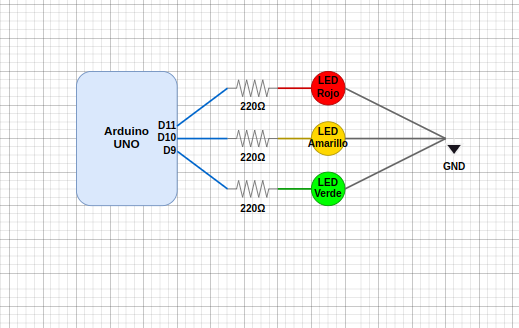
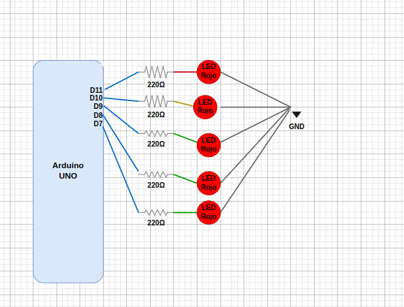

# DOCTORADO EN INGENIERÍA APLICADA
## ASIGNATURA: SEMINARIO DE ELECTRONICA

### Práctica 1: Semáforo y Secuencia Auto Increíble
 
**Alumno:** ISMAEL RUFINO GRAJEDA MARÍN

**Asesor:** DR. JOSÉ ANTONIO GÓMEZ LUNA

---

## Introducción

Los diodos emisores de luz (LED) son componentes electrónicos semiconductores que convierten la energía eléctrica en luz visible cuando se polariza directamente. A diferencia de las bombillas tradicionales, los LEDs son más eficientes energéticamente, tienen una vida útil más larga y son más resistentes a los impactos.

Los LEDs funcionan mediante el principio de electroluminiscencia, donde los electrones al pasar por el material semiconductor liberan energía en forma de fotones. La longitud de onda (color) de la luz emitida depende del material semiconductor utilizado en su fabricación.

Características principales de los LEDs:
- Voltaje típico de operación: 1.8V - 3.3V (depende del color)
- Corriente de operación: 10mA - 20mA
- Alta eficiencia energética (90% superior a bombillas incandescentes)
- Tiempo de respuesta rápido (nanosegundos)
- No requieren tiempo de calentamiento

## Metodología

### Práctica 1: Semáforo
1. Diseño del circuito con 3 LEDs (rojo, amarillo y verde)
2. Conexión de LEDs a pines digitales de Arduino
3. Programación de secuencia temporizada
4. Pruebas y ajustes de tiempos

### Práctica 2: Secuencia Auto Increíble
1. Diseño del circuito con 8 LEDs
2. Conexión en serie de LEDs a pines digitales
3. Programación de efecto de desplazamiento
4. Ajuste de velocidad de la secuencia

## Desarrollo

### Práctica 1: Semáforo
Se implementó un sistema de semáforo utilizando tres LEDs (rojo, amarillo y verde) controlados por Arduino. El sistema simula el funcionamiento de un semáforo real con tiempos de espera apropiados para cada estado.

### Práctica 2: Secuencia Auto Increíble
Se desarrolló una secuencia de luces tipo "auto fantástico" utilizando 5 LEDs. La secuencia crea un efecto de movimiento donde la luz se desplaza de un extremo a otro y regresa, creando una animación fluida.

## Código Utilizado

### Práctica 1: Semáforo
```cpp
const int RED = 11;
const int YELLOW = 10;
const int GREEN = 9;
int lights[3] = {GREEN, YELLOW,RED};
int step = 0;

void setup() {
  Serial.begin(9600);
  pinMode(RED, OUTPUT);
  pinMode(YELLOW, OUTPUT);
  pinMode(GREEN, OUTPUT);
}

void change(){
  for(int i = 0; i < 3; i++){
    digitalWrite(lights[i], LOW);
  }
  digitalWrite(lights[step], HIGH);
}

void loop() {
  delay(5000); 
   change(); 
   step = (step + 1) % 3;
}
```

### Práctica 2: Secuencia Auto Increíble
```cpp
int pins[5] = {7,8,9,10,11};
int step = 0;
int direction = 1;

void setup() {
  Serial.begin(9600);
  for(int i = 0; i < 5; i++){
    pinMode(pins[i], OUTPUT);
  }
}

void change(){
  for(int i = 0; i < 5; i++){
      digitalWrite(pins[i], LOW);
  }
  digitalWrite(pins[step], HIGH);
  next();
}

void next(){
  step += direction;
  if(step >= 4){
    direction = -1;
  }
  if(step <= 0){
    direction = 1;
  }
}

void loop() {
  delay(200); 
  change(); 
}
```

## Diagramas de Circuitos

### Práctica 1: Semáforo


### Práctica 2: Secuencia Auto Increíble


## Resultados Observados

### Práctica 1: Semáforo
- Funcionamiento correcto de la secuencia de semáforo
- Tiempos de transición adecuados entre estados (5 segundos)
- Comportamiento estable y repetible
- Transiciones suaves entre estados

### Práctica 2: Secuencia Auto Increíble
- Efecto visual fluido del desplazamiento de luz
- Transiciones suaves entre LEDs cada 200ms
- Cambio de dirección automático en los extremos
- Secuencia cíclica continua sin interrupciones

## Conclusión

Las prácticas realizadas permitieron implementar exitosamente dos aplicaciones diferentes utilizando LEDs y Arduino. El semáforo demostró la capacidad de crear sistemas de señalización temporizada, mientras que la secuencia auto increíble mostró la versatilidad de los LEDs para crear efectos visuales dinámicos.

La programación en Arduino demostró ser una herramienta efectiva para el control preciso de los tiempos y secuencias, permitiendo crear patrones complejos de iluminación con componentes simples. Los resultados obtenidos fueron satisfactorios, logrando un funcionamiento estable y preciso en ambas prácticas.

## Bibliografía

1. Banzi, M., & Shiloh, M. (2014). Getting Started with Arduino: The Open Source Electronics Prototyping Platform. Maker Media, Inc.

2. Platt, C. (2017). Encyclopedia of Electronic Components Volume 3: Sensors for Location, Presence, Proximity, Orientation, Oscillation, Force, Load, Human Input, Liquid ... Light, Heat, Sound, and Electricity. Maker Media, Inc.

3. Scherz, P., & Monk, S. (2016). Practical Electronics for Inventors, Fourth Edition. McGraw Hill Professional.